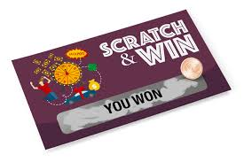

# Cartes à gratter – Encore raté, j'étais pourtant si proche 😂

Pour les fêtes, vous avez peut-être reçu des cartes à gratter. Avez-vous gagné le gros lot ? Bon j'imagine que vous ne seriez pas là si c'était le cas. Avez-vous été "proche" de gagner ?!

**Dates** : du 12/01/25 au 19/01/25

**Difficulté** : Facile

**Technologies** : Java 17+ ou Kotlin



## Objectif

Créer un algorithme en Java capable de générer 100 cartes à gratter. Chaque carte doit donner l'impression que le joueur est proche de gagner, mais seulement 10 cartes doivent être réellement gagnantes. L'objectif est que le jeu rapporte 100 euros à l'éditeur, pour 100 cartes publiées (donc 1 euros par carte).

## Contexte

Un jeu à gratter contient plusieurs zones, chacune affichant un symbole ou un nombre. Pour gagner, un joueur doit obtenir une combinaison spécifique, comme trois symboles identiques. Les cartes perdantes doivent être conçues de manière à donner l'impression que le joueur était sur le point de gagner.

## Règles du Jeu

**A la façon du Morpion**, chaque carte contient 9 cases organisées en une grille de 3x3.
  - Une carte est gagnante si elle contient 3 symboles identiques alignés horizontalement, verticalement ou en diagonale.
  - Seules 10 cartes parmi les 100 générées doivent être gagnantes.
  - Les cartes perdantes doivent inclure au moins deux symboles identiques dans plusieurs lignes, colonnes ou diagonales pour donner l'illusion d'une victoire proche.

## Contraintes Financières

  - Le coût par carte est de **2 euro**.
  - Chaque carte gagnante rapporte un prix de **5 euros**.
  - Le jeu doit rapporter **100 euros** à l'éditeur.

## Détails du Défi

  1. Génération des Cartes : Écrivez une fonction qui génère aléatoirement les symboles pour chaque carte.
  2. Détection des Gagnants : Implémentez une logique pour garantir que seules 10 cartes sont gagnantes.
  3. Illusion de Victoire : Assurez-vous que les cartes perdantes semblent être proches de la victoire.
  4. Rapport Financier : Vérifiez que l'algorithme respecte les contraintes financières du jeu.

## Exemple de visualisation

Tout se passera dans la console.
Affichez la première carte comme suit (libre à vous d'utiliser les symboles de votre choix).

```dos
+---+---+---+
| A | A | D |
+---+---+---+
| C | B | A |
+---+---+---+
| B | C | D |
+---+---+---+
```
*Note : Ici, le joueur a presque trois "A" en ligne, mais manque le troisième "A" pour gagner.*

Demandez ensuite à l'utilisateur s'il souhaite voire la carte suivante. etc...


## Bonus

1. Méthodes pures
  - Faites en sorte d'utiliser uniquement des méthodes pures
2. Testabilité
  - Créez un jeu de tests unitaires, faites en sorte de trouver les *classes équivalentes* et de créer les "Base case", "Boundary case", "Edge case" ou potentiels "Corner case".

## Récompenses
- Vainqueur : 5 pts
- 2ème : 3 pts
- 3ème : 1 pts

Rappel: Les participants accumulent des points en fonction de leur performance dans les challenges. Ces points peuvent être convertis en cartes cadeaux Prezzy, utilisables pour des achats en ligne ou en magasin dans n'importe quelle devise.

💬 **N'oubliez pas** de poser vos questions sur le serveur Discord pour toute clarification ou aide sur ce challenge. Bonne chance à tous et amusez-vous bien ! 🎉
